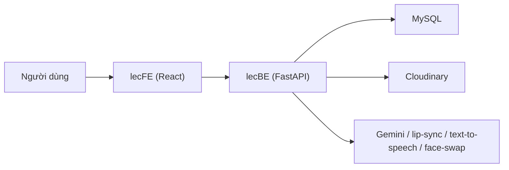

# lecgen

Hệ thống tạo video bài giảng/thuyết minh từ:

- `text` (AI sinh cấu trúc slide + nội dung + script, sau đó tạo video)
- `pdf`
- `ppt/pptx`

Ngoài luồng tạo video, project còn có thư viện media (ảnh/video/giọng nói), video ghép mặt (lip-sync), và cơ chế theo dõi tiến trình tạo video theo từng slide (job-based progress).

## Kiến trúc tổng quan



## Cấu trúc repo

| Thư mục | Vai trò |
|---|---|
| `Lecture-Video-Generate-FE/` | Frontend React (CRA + TypeScript). UI tạo video, chỉnh script, theo dõi job, thư viện media. |
| `Lecture-Video-Generate-BE/` | Backend FastAPI. Auth, media APIs, xử lý PDF/PPTX, rewrite script, tạo/lưu job video, worker nền, tích hợp Cloudinary + AI + TTS/LipSync. |

## Tính năng chính hiện tại

- Tạo slide từ text (`TextToSlideAndVideo`)
- Upload PDF/PPTX -> trích xuất slide -> rewrite script theo context -> tạo video
- Chọn video người nói + giọng nói trước khi render
- Tạo video theo từng slide, theo dõi tiến trình
- Ghép video final sau khi toàn bộ slide hoàn tất
- Thư viện ảnh / video / giọng nói / video ghép mặt

## Yêu cầu môi trường

### Chung

- `Git`
- `Docker` + `Docker Compose` (khuyến nghị để chạy ổn định)

### Chạy local (không Docker)

- `Node.js 18+` (cho `lecFE`)
- `Python 3.11` (cho `lecBE`)
- `MySQL 8` (cho `lecBE`)
- `LibreOffice` + `poppler-utils` + `ffmpeg` (để backend xử lý PPTX/PDF/media)

Ubuntu:

```bash
sudo apt-get update
sudo apt-get install -y libreoffice poppler-utils ffmpeg
```

### Chạy GPU services (`lecVoice`, `lecLip`)

- Máy Linux có NVIDIA GPU (khuyến nghị)
- Driver NVIDIA phù hợp
- `nvidia-container-toolkit` nếu chạy bằng Docker GPU

## Quick Start (khuyến nghị)

### Phương án A: Dev nhanh FE + BE local, dùng TTS/LipSync external hoặc server khác

Phù hợp khi đang UI/BE, chưa cần chạy GPU services trên máy local.

#### 1) Backend (`Lecture-Video-Generate-BE`)

```bash
cd Lecture-Video-Generate-BE
python3.11 -m venv .venv
source .venv/bin/activate
pip install -r requirements.txt
cp .env.example .env
```

Tạo DB (nếu chưa có):

```bash
mysql -u root -p -e "CREATE DATABASE IF NOT EXISTS lecvid_gen CHARACTER SET utf8mb4 COLLATE utf8mb4_unicode_ci;"
```

Cấu hình nhanh (có thể export đè lên `.env`):

```bash
export DATABASE_URL="mysql+mysqlconnector://root:<password>@127.0.0.1:3306/lecvid_gen"
```

Chạy backend:

```bash
python3.11 -m uvicorn app.main:app --host 0.0.0.0 --port 9000 --reload
```

#### 2) Frontend (`Lecture-Video-Generate-FE`)

```bash
cd Lecture-Video-Generate-FE
npm install
cp .env.example .env
npm start
```

Lưu ý:

- `REACT_APP_PROXY_TARGET` nên trỏ tới `http://127.0.0.1:9000`
- `REACT_APP_API_BASE_URL=/api/v1` để FE gọi API qua proxy dev của CRA

### Phương án B: Chạy bằng Docker (modular theo từng service)

Repo hiện tại dùng nhiều `docker-compose.yml` riêng theo sub-project.

#### 1) Backend + MySQL

```bash
cd Lecture-Video-Generate-BE
cp .env.example .env
docker compose up -d --build
```

Backend expose tại `http://localhost:9000`

#### 2) Frontend

```bash
cd Lecture-Video-Generate-FE
cp .env.example .env
docker compose up -d --build
```

Frontend expose tại `http://localhost:3000`

## Hướng dẫn cấu hình môi trường (tối thiểu)

### `lecBE/.env`

Các biến quan trọng:

- `DATABASE_URL`
- `MYSQL_ROOT_PASSWORD`, `MYSQL_DATABASE`
- `CLOUDINARY_CLOUD_NAME`, `CLOUDINARY_API_KEY`, `CLOUDINARY_API_SECRET`
- `GEMINI_API_KEY`, `GEMINI_REWRITE_API_KEY`
- `TTS_API_URL`, `FAKELIP_API_URL`
- `PUBLIC_STATIC_URL` 

### `lecFE/.env`

- `REACT_APP_API_BASE_URL=/api/v1` (khuyến nghị khi FE và BE cùng domain/proxy)
- `REACT_APP_PROXY_TARGET=http://127.0.0.1:9000` (cho `npm start`)
- `REACT_APP_CLOUDINARY_CLOUD_NAME`
- `REACT_APP_CLOUDINARY_UPLOAD_PRESET`

### `lecVoice/.env`

- Cloudinary keys
- `VIETVOICE_MODEL_PATH`
- `VIETVOICE_MODE` (`direct` hoặc `subprocess`)
- `GPU_USAGE_THRESHOLD`, `GPU_RESTART_DELAY_SEC`, `GPU_RESTART_COOLDOWN_SEC`
- `NGROK_ENABLED=1` (nếu muốn public API tạm thời qua ngrok)

### `lecLip/.env`

- Cloudinary keys
- `EASY_WAV2LIP_CHECKPOINT`
- Các tham số batch/resize (`EASY_WAV2LIP_*`)
- `NGROK_ENABLED=1` (nếu muốn public API tạm thời qua ngrok)

## Tích hợp giữa các service

`lecBE` gọi:

- `TTS_API_URL` -> `lecVoice` (`POST /vietvoice`)
- `FAKELIP_API_URL` -> `lecLip` (`POST /fakelip`)

Luồng tạo video (rút gọn):

1. FE tạo `video job` tại `lecBE`
2. `lecBE` worker xử lý từng slide:
   - gọi `lecVoice` tạo audio
   - gọi `lecLip` tạo lip-sync video
   - ghép slide image + speaker video
3. FE polling job detail để hiển thị tiến trình từng slide
4. Khi tất cả slide xong -> người dùng bấm tạo `video final`

## Test / kiểm tra nhanh

### Frontend

```bash
cd Lecture-Video-Generate-FE
npm run build
```

### Backend contract tests

```bash
cd Lecture-Video-Generate-BE
python3.11 -m pytest tests/contracts -q -s
```

## Lưu ý khi deploy production (HTTPS)

- FE nên gọi API bằng path tương đối: `REACT_APP_API_BASE_URL=/api/v1`
- Reverse proxy (Nginx) cần proxy:
  - `/api/v1/` -> `lecBE`
  - `/be-static/` -> `lecBE`
- Set `PUBLIC_STATIC_URL=https://<domain>/be-static` để tránh lỗi mixed content khi hiển thị ảnh slide/media
- Khi thay đổi biến `REACT_APP_*`, cần **rebuild FE image** (CRA inject env tại build time)

## Lỗi thường gặp

### `Unknown database 'lecvid_gen'`

Database chưa tồn tại (hoặc volume MySQL cũ không tự tạo lại DB). Tạo DB thủ công:

```bash
mysql -u root -p -e "CREATE DATABASE IF NOT EXISTS lecvid_gen CHARACTER SET utf8mb4 COLLATE utf8mb4_unicode_ci;"
```

Hoặc với Docker:

```bash
cd Lecture-Video-Generate-BE
docker compose exec db sh -lc 'mysql -uroot -p"$MYSQL_ROOT_PASSWORD" -e "CREATE DATABASE IF NOT EXISTS lecvid_gen CHARACTER SET utf8mb4 COLLATE utf8mb4_unicode_ci;"'
```

### PPTX convert lỗi `LibreOffice not found`

Cài `libreoffice` trên máy chạy backend (nếu chạy local/direct).

### Upload lớn bị `413 Request Entity Too Large`

Tăng `client_max_body_size` ở reverse proxy / Nginx phía trước FE hoặc BE.

### Docker GPU lỗi `could not select device driver "nvidia"`

Chưa cài `nvidia-container-toolkit` hoặc Docker chưa cấu hình runtime GPU.